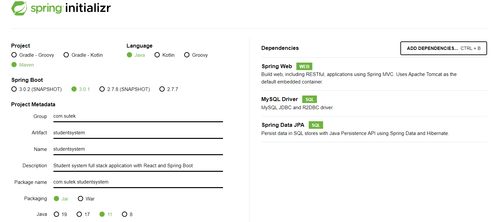
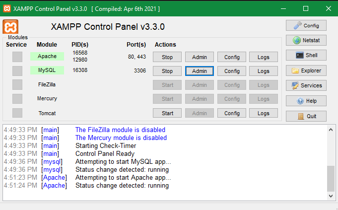
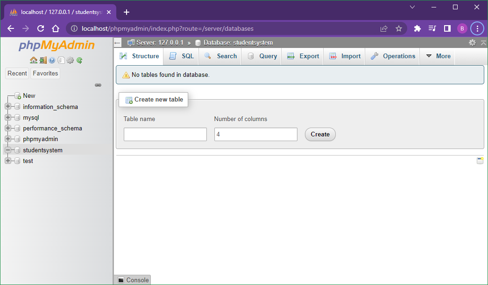
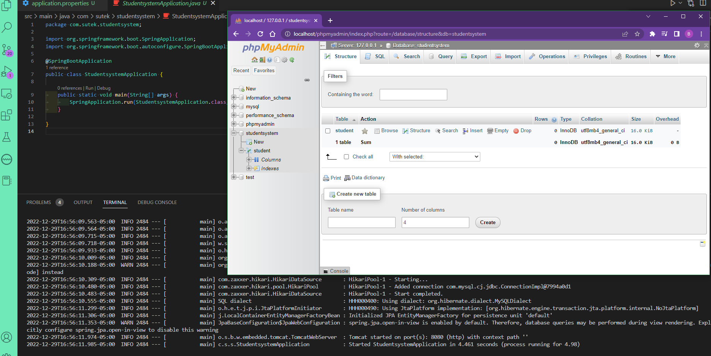
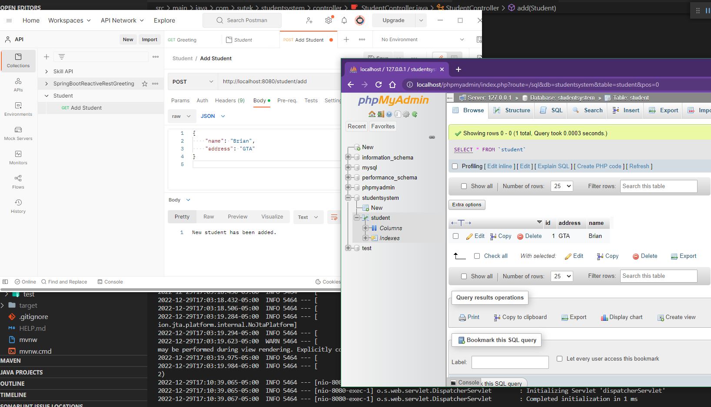

# Full Stack with React and Spring Boot

- [Backend](#backend)
  - [Spring Initializr](#spring-initializr)
  - [MySQL](#mysql)
  - [Java Spring Boot](#java-spring-boot)
- [Frontend](#frontend)
  - [React](#react)

Student system full stack application with React and Spring Boot

## Backend

### Spring Initializr



### MySQL

XAMPP Control Panel







### Java Spring Boot

Postman



## Frontend

### React

`npx create-react-app student-frontend`

```dos
npm i @material-ui/core
npm i @material-ui/icons
```
