# React stuff

## Convert a SVG file to a JSX component

Steps (use LockClosed as an example):

- Download LockClosed.svg

- Open it in VSCode (plain text format)

- Copy the text and paste to SVGR playground (<https://react-svgr.com/playground/>)

- Copy the converted jsx to VSCode and use it to create a new file LockClosed.jsx

- Use Add.jsx as a reference, add the following lines:

```javascript
import SVGIcon from '../SVGIcon';

const copyDictionary = {
  en: {
    a11yText: 'LockClosed',
  },
  fr: {
    a11yText: 'VerrouillerFermé',
  },
};
```

- Use Google Translate to get French translations

- Refer to Add.jsx, update these lines

```javascript
const SvgComponent = (props) => {
  const viewBox = '0 0 21 20';
  return (
    <SVGIcon {...props} copyDictionary={copyDictionary} viewBox={viewBox}>
      <path
        fillRule="evenodd"
        clipRule="evenodd"
        d="M10.5 20c-5.514 0-10-4.486-10-10s4.486-10 10-10 10 4.486 10 10-4.486 10-10 10Zm0-19.13C5.465.87 1.37 4.965 1.37 10c0 5.035 4.095 9.13 9.13 9.13 5.035 0 9.13-4.095 9.13-9.13 0-5.035-4.095-9.13-9.13-9.13Zm-.58 9.71-4.75-.146a.527.527 0 0 1-.503-.524v.175c0-.276.224-.504.501-.504h4.748v-.084l.148-4.825a.533.533 0 0 1 .526-.505h-.175c.279 0 .504.222.504.501v4.913h4.913c.279 0 .501.225.501.504V9.91a.533.533 0 0 1-.504.526l-4.826.148h-.084v4.748a.504.504 0 0 1-.504.501h.175a.527.527 0 0 1-.524-.502l-.146-4.75Z"
        fill="#fff"
      />
    </SVGIcon>
  );
};
```

- Make sure the viewBox values are copied properly from the SVGR playground

e.g. `const viewBox = '0 0 21 20'`

- npm run storybook

- Verify in storybook

- Unit tests

`npm run test`

svg.spec.jsx

```javascript
describe('LockClosed', () => {
  afterEach(cleanup);
  it('should return LockClosed icon', () => {
    render(<Icon icon="lockclosed" size="xl" />);
    // check a11yText of LockClosed icon
    expect(screen.getByText('LockClosed')).toBeInTheDocument();
  });

  it('should return LockClosed icon with custom fill', () => {
    const { container } = render(
      <Icon icon="lockclosed" size="xxl" fill="#c12335" />
    );
    expect(container.querySelector("[fill='#c12335']")).toBeInTheDocument();
  });
});
```

## Convert a component to a separate npm package

Steps:

- Create a repo
- Put all files to ./src folder
- Resolve dependencies
  - devDependencies & peerDependencies
- npm run storybook
- npm run test / jest
- npm run lint
- PR
- GitHub actions

## React BDD test with Jest and Enzyme

BDD

Jest (from facebook) config

Enzyme (from airbnb) adapter set up

```dos
npx create-react-app ...
npm i -D enzyme enzyme-react-16
```

enzyme-react only supports react v16

enzyme-react-16

Someone did something for react v17

@someone/enzyme-react-17

## React Storybook

```dos
npx create-react-app react-storybook-simple
npx sb init
npm run storybook
```

## React MDX

## PropTypes

## SWR Mutation

simplify the code

## React Query

Pagination and caching

## Suspense

## Error Boundaries

A JavaScript error in a part of the UI shouldn’t break the whole app. To solve this problem for React users, React 16 introduces a new concept of an “error boundary”.

Error boundaries are React components that catch JavaScript errors anywhere in their child component tree, log those errors, and display a fallback UI instead of the component tree that crashed. Error boundaries catch errors during rendering, in lifecycle methods, and in constructors of the whole tree below them.

## Mock/Fake with MirageJS

## Formik

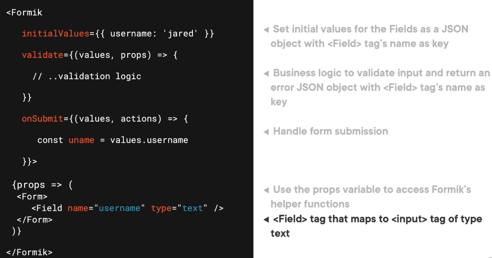

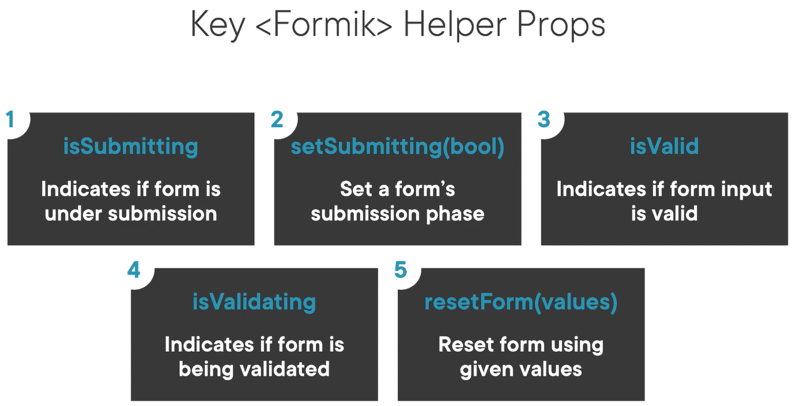

useField

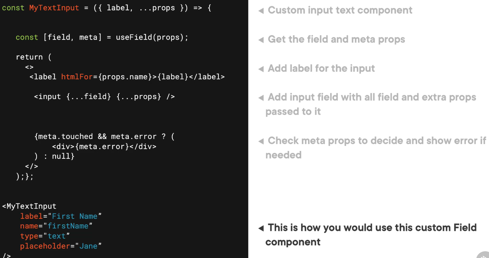

## Yup

Yup is a schema builder for runtime value parsing and validation.

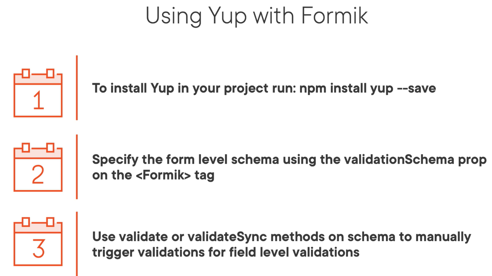

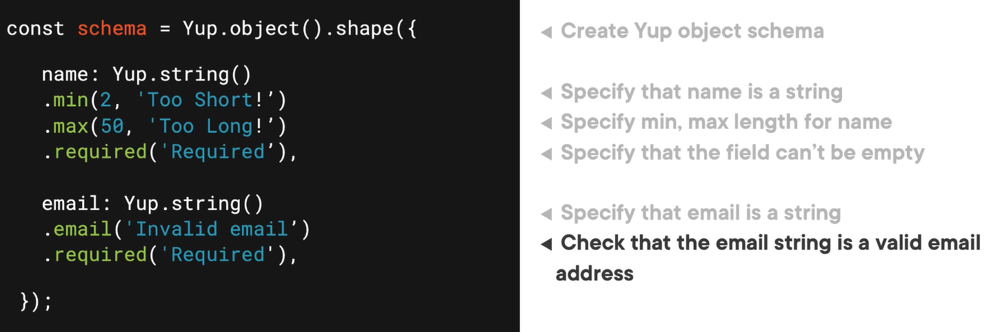

Yup resolver

Yup schema

## Uncontrolled form vs Controller form

In most cases, React recommend using controlled components to implement forms. In a controlled component, form data is handled by a React component. The alternative is uncontrolled components, where form data is handled by the DOM itself.

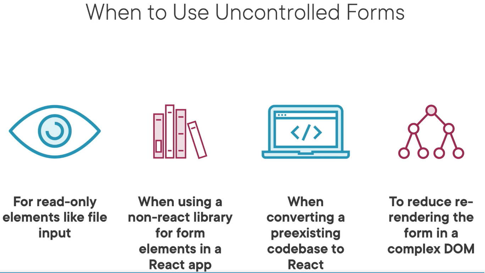

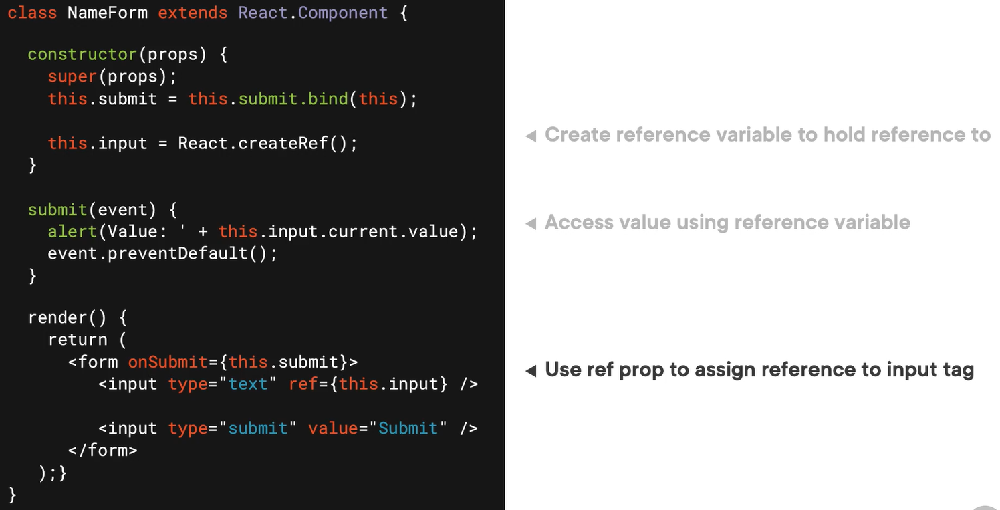

## Vanilla React

## React Hook Form

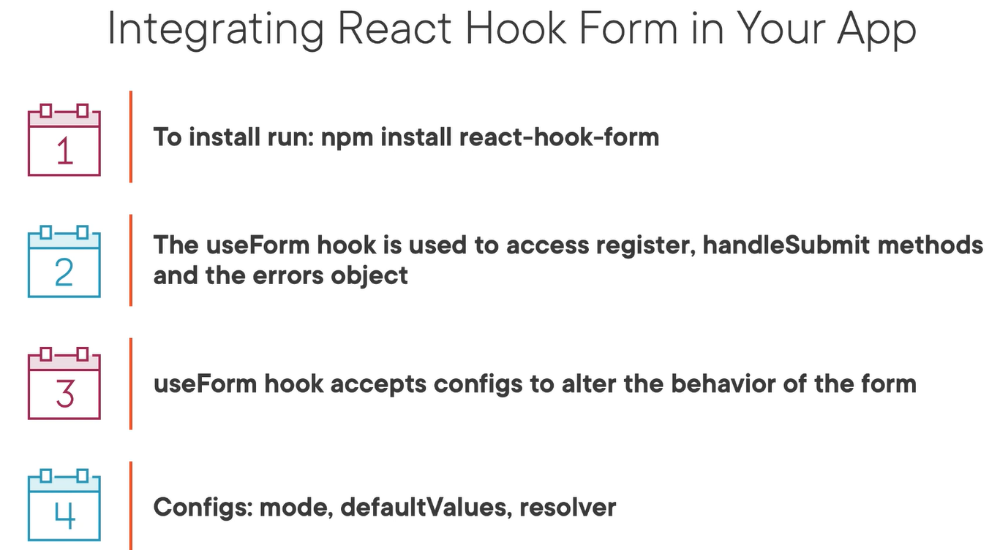

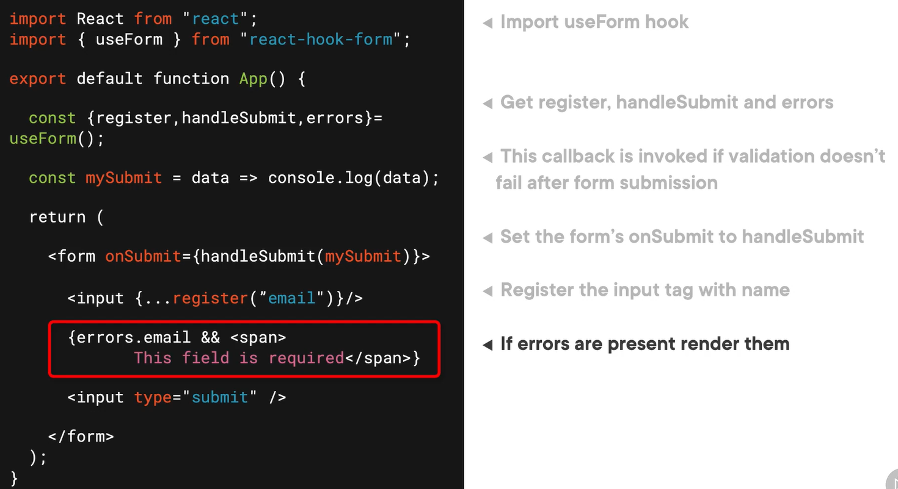

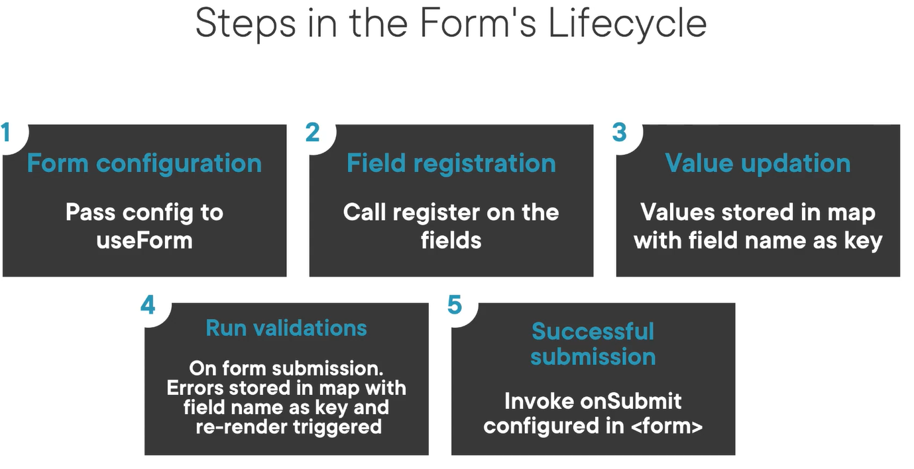

## Function vs Class

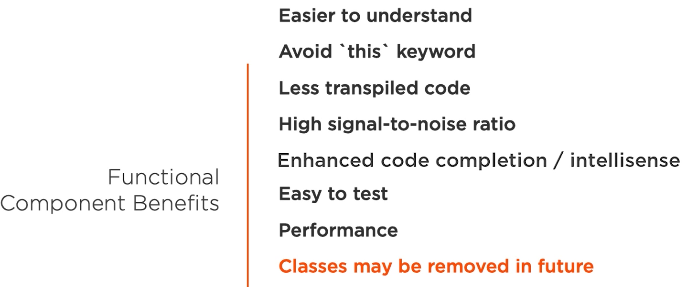

## Handle immutable state


## Flux vs Redux

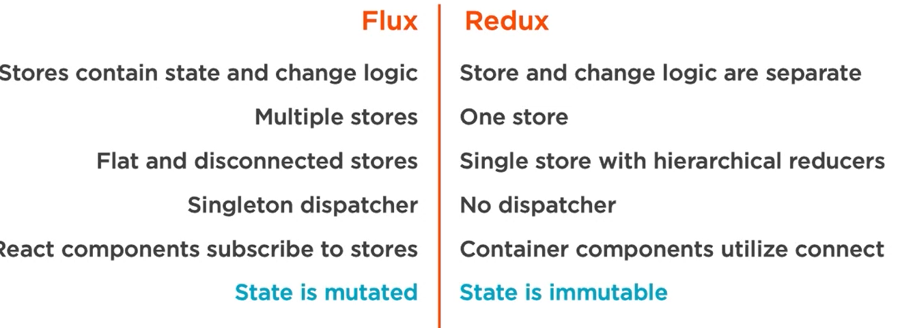

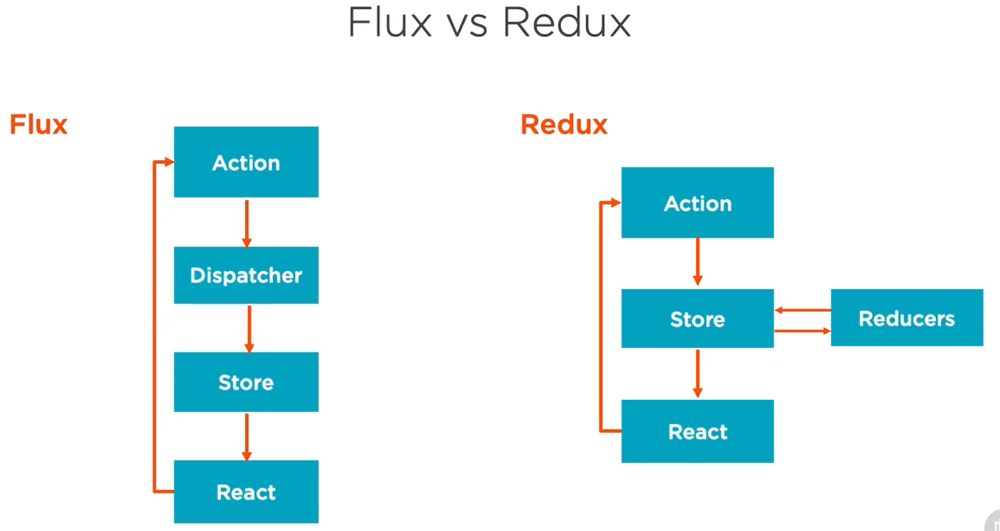

## Redux

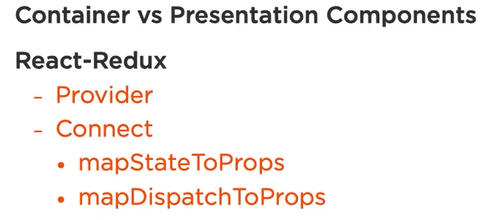

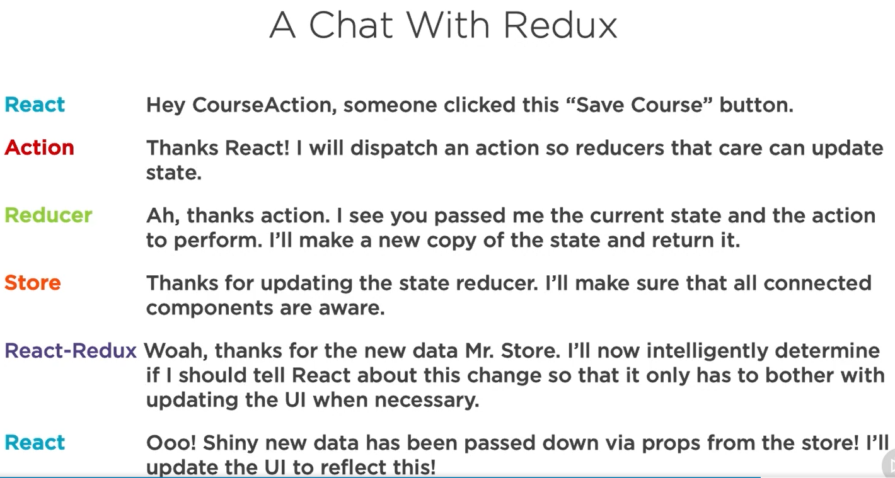

Redux middleware

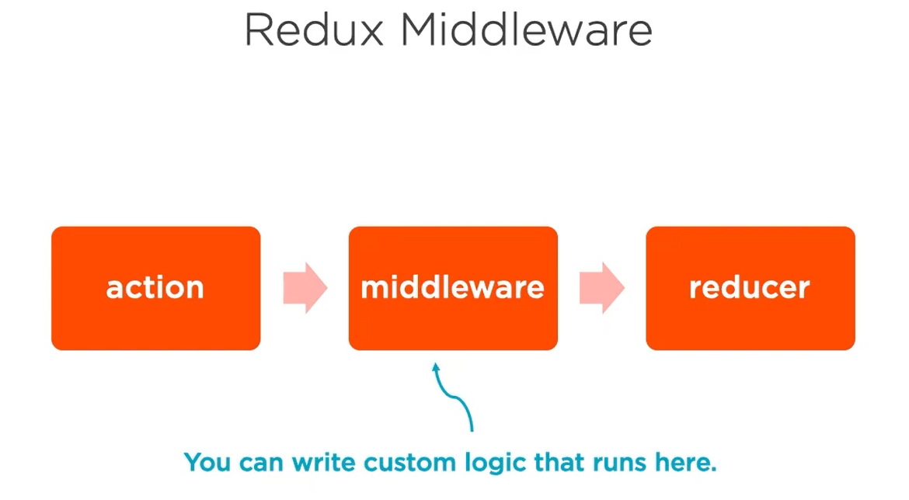

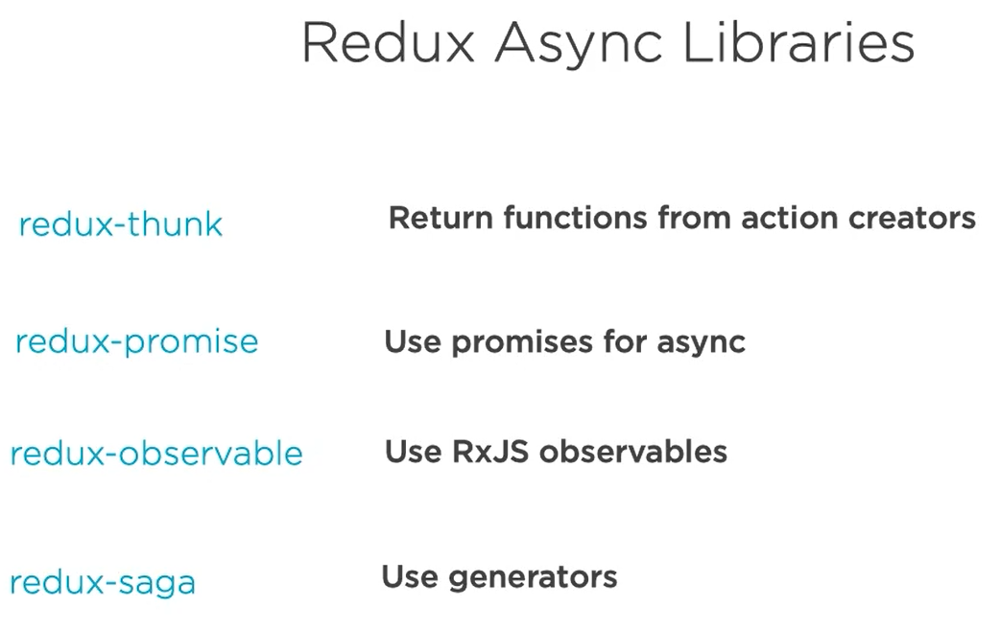

Redux Thunk

`import thunk from "react-thunk"`

Redux vs local state

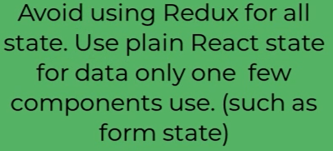

```dos
npm i redux react-redux redux-thunk
```

Redux hooks - useSelector & useDispatch

action

reducer

store

## CommonJS

## PostCSS and cssnano plugin

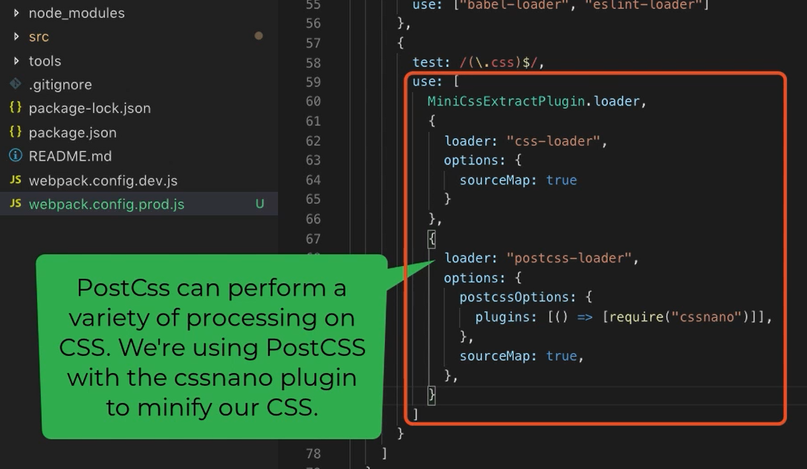

## redux-logger

## react-table

## Deploy React to Azure with Azure DevOps kickstart

Deploying a React application to Azure using Azure DevOps involves a series of steps, and I'll provide a kickstart guide to help you get started. This guide assumes you have a React application set up and a Microsoft Azure account. If you don't have an Azure DevOps account, you can create one for free.

Here are the steps to deploy your React app to Azure with Azure DevOps:

1. **Set up Azure DevOps Project:**

   - Sign in to your Azure DevOps account and create a new project.
   - Set up your repository in Azure DevOps. You can use Azure Repos or connect an external repository (e.g., GitHub or Bitbucket) to Azure DevOps.

2. **Create a Build Pipeline:**

   - In your Azure DevOps project, go to "Pipelines" and create a new pipeline.
   - Choose a repository source and configure your pipeline according to your project's needs. For a React app, you'll typically use a Node.js-based pipeline.
   - Define your build steps. This will typically involve tasks such as installing dependencies, building the React app, and creating an optimized production build.

3. **Configure Environment Variables:**

   - If your application relies on environment variables, make sure you define them in your Azure DevOps pipeline so they are accessible during the build and deployment process.

4. **Create a Release Pipeline:**

   - In Azure DevOps, navigate to "Pipelines" > "Releases."
   - Create a new release pipeline that will deploy your React app to Azure. You can use the "Azure App Service Deployment" task for this.
   - Connect your Azure subscription by configuring service connections.

5. **Deploy to Azure App Service:**

   - In your release pipeline, add a stage for deploying to Azure App Service.
   - Configure the stage with the target Azure App Service where you want to deploy your React app.
   - Define the package or artifact to deploy (usually, it's the build output from the build pipeline).

6. **Continuous Deployment (Optional):**

   - If you want to set up continuous deployment, you can enable triggers so that your app gets automatically deployed when changes are pushed to the specified branch.

7. **Approvals and Gates (Optional):**

   - For production deployments, consider adding approvals and gates for an additional layer of control and verification.

8. **Save and Trigger Deployment:**

   - Save your release pipeline configuration and trigger a new deployment.

Now, when you push changes to your repository, Azure DevOps will automatically build and deploy your React application to Azure App Service.

Remember that this is a simplified guide, and the exact steps may vary based on your project requirements and Azure App Service setup. Be sure to adjust the pipeline to match your specific needs, including environment-specific configuration, security, and branch policies. Additionally, consider using environment-specific configuration files or Azure Key Vault for storing sensitive information like API keys or secrets.
