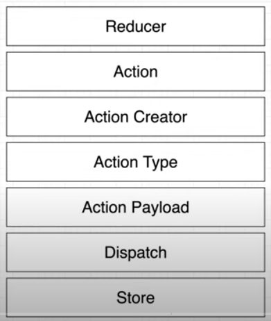
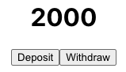

# React Redux Bank App

## Architecture

Reducer

Action

Action Creator

Action Type

Action Payload

Dispatch

Store



## Flow

account -> accountReducer

users -> usersReducer

## Commands

```dos
npx create-react-app react-redux-bank-simple
npm i redux react-redux redux-thunk
npm run start
npx create-react-app my-app --template redux
```

## Points

combineReducers

createStore

@deprecated

We recommend using the configureStore method of the @reduxjs/toolkit package, which replaces createStore.

Redux Toolkit is our recommended approach for writing Redux logic today, including store setup, reducers, data fetching, and more.

For more details, please read this Redux docs page: <https://redux.js.org/introduction/why-rtk-is-redux-today>


