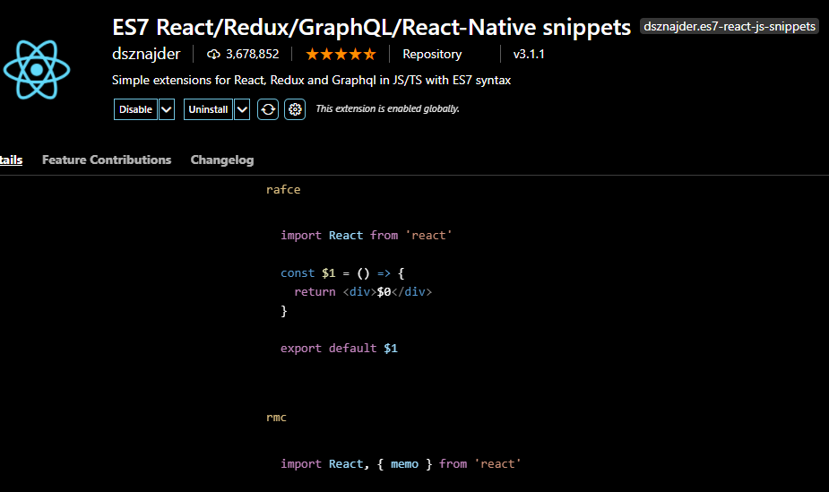
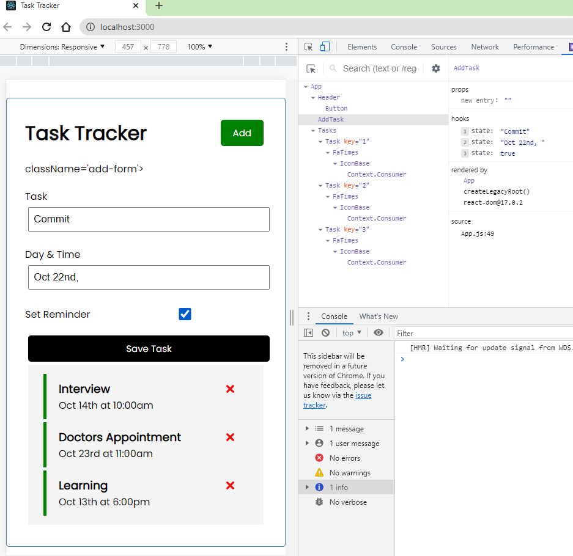
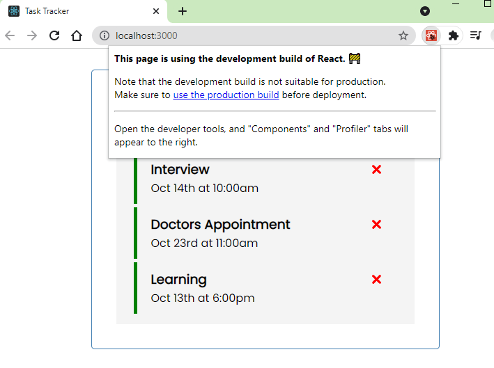
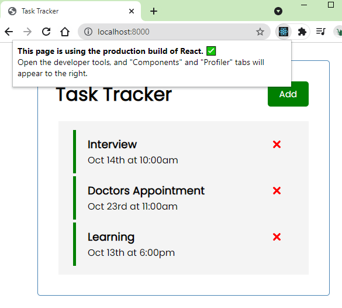

# My Task Tracker React App

## Set up

```
npx create-react-app react-task-tracker
npm i react-icons
npm i json-server
npm run server
npm i react-router-dom
npm start
http://localhost:3000
npm run build
npm i -g serve
npm run serve
http://localhost:8000
```

## Knowledge Points

```
Function vs Class
Extension
Promise
useHooks
Fetch API
React Icons
React Router
JSON Server
```

## Screenshot








